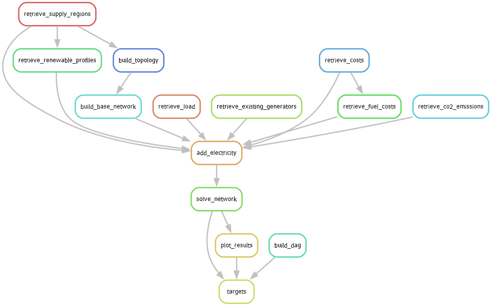

# pypsa-illinois
A model of the Illinois electricity system built with PyPSA.


# Installation

#### Requirements

* git
* Either `conda` or `mamba` installed
    
> [!WARNING] 
> Running `conda update --all` may downgrade `pypsa` to 0.25.x to accomodate an update to `pyomo`. This will break the code. After running update, run `conda update pypsa` to fix.

1. Clone the repository

```bash
git clone https://github.com/ucsusa/pypsa-illinois.git
```

2. Set up the environment

```bash
cd pypsa-illinois
mamba env create  # mamba and conda may be used interchangeably, here
mamba activate pypsa-illinois
```

3. Creating the `.env` file

Users should copy the `.env.template` file into a new file simply called `.env`.
This file contains "secret" information, such as API keys, emails, and other data
that should remain local. In order to run the current model, users must have API keys
from the following organizations:

* NREL
* EIA

These keys may be added directly to the `.env` file.    

# Running the model 

This project uses the workflow management tool, `snakemake`, to create a reproducible data pipeline.
Running the command

```bash
snakemake --cores=1
```

will run the workflow illustrated in the directed acyclic graph (DAG) shown below.




